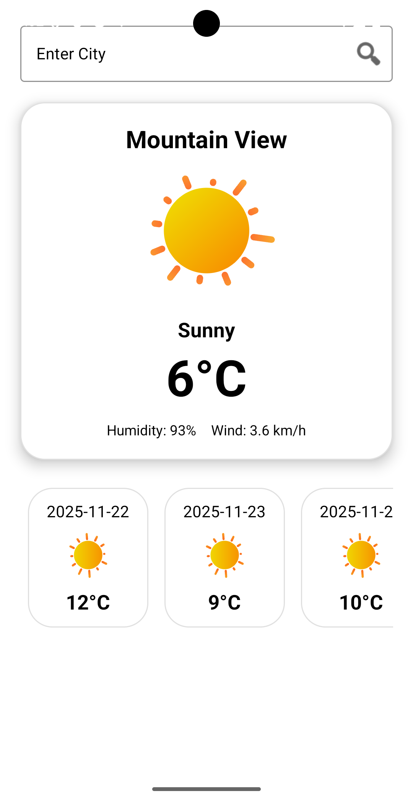
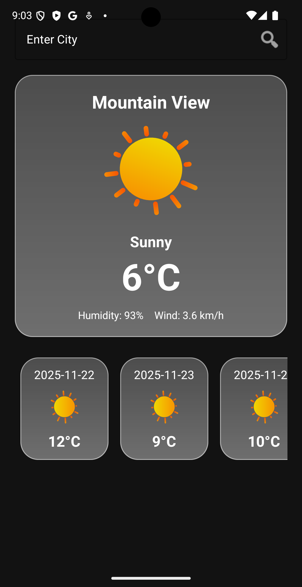

# WeatherApp

This is a simple weather forecast app for Android, built as a student project. It allows you to check the current weather and a 5-day forecast for any city, or for your current location.

## Screenshots

Here's a preview of the app in both light and dark modes.

|          Light Theme          |          Dark Theme          |
|:-----------------------------:|:----------------------------:|
|  |  |


## Features

*   **Current Weather:** Get the temperature, condition, humidity, and wind speed.
*   **5-Day Forecast:** See the weather forecast for the next 5 days.
*   **Location-Based Weather:** Automatically fetches weather for your current location on startup.
*   **City Search:** Manually search for the weather in any city.
*   **Dynamic UI:** The app's background and animations change based on the weather conditions (sunny, rainy, cloudy).
*   **Offline Support:** Caches the last weather data so you can still see it when you're offline.
*   **Light & Dark Theme Support:** The app's UI adapts to your device's theme.

## Technologies Used

*   **Java** and **Android Studio**
*   **Retrofit:** For making API calls to the weather service.
*   **Room:** For local database caching.
*   **Lottie:** For cool weather animations.
*   **Material Components:** For modern UI elements.
*   **ViewModel & LiveData:** For a robust, lifecycle-aware architecture.

## Setup

1.  **Clone the repository:**
    ```bash
    git clone https://github.com/your-username/WeatherApp.git
    ```
2.  **Open in Android Studio:** Open the project in Android Studio.
3.  **Get an API Key:** This project uses the [WeatherAPI](https://www.weatherapi.com/). You'll need to sign up for a free account to get your own API key.
4.  **Add your API Key:** Open `app/src/main/java/me/punya/weatherappp/MainActivity.java` and replace `YOUR_API_KEY` with your actual key:
    ```java
    private static final String API_KEY = "YOUR_API_KEY";
    ```
5.  **Run the app:** Build and run the project on an Android device or emulator.

---

*This project was created for educational purposes.*
